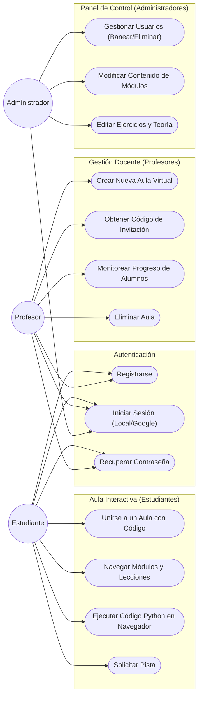
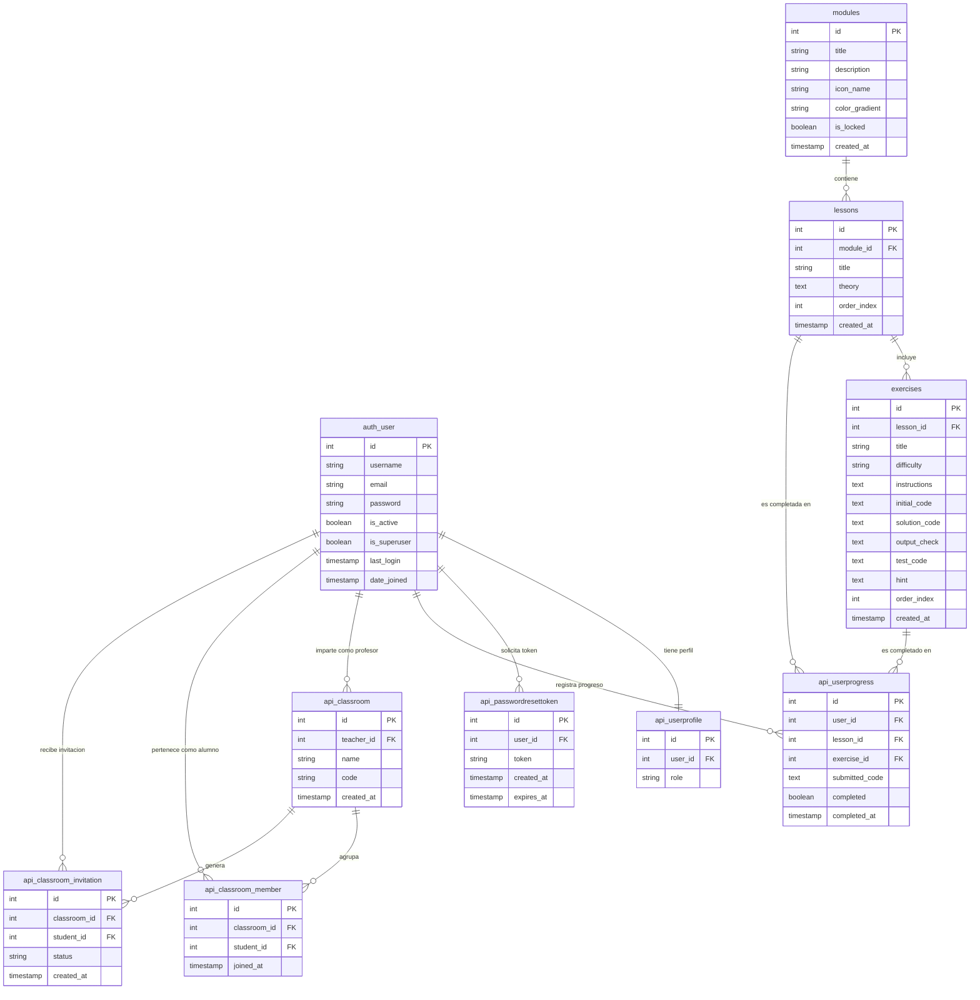
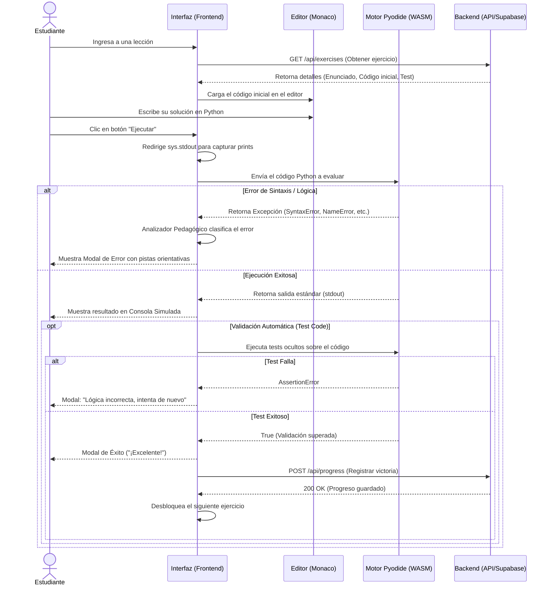
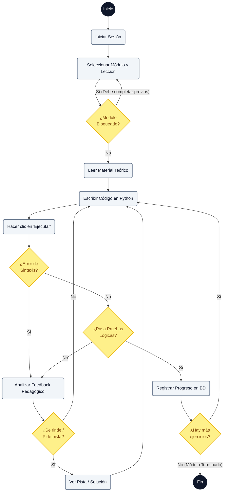
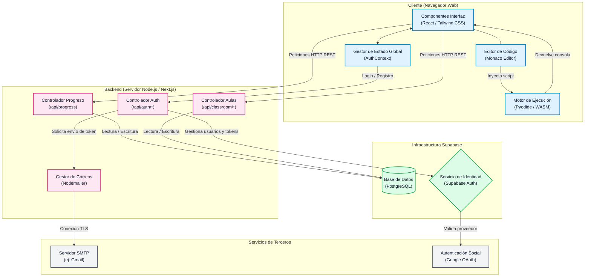

# Diagramas del Sistema (PyLearn)

---

## 1. Diagrama de Casos de Uso

A continuación se presenta el modelo de Casos de Uso del sistema, el cual describe las interacciones entre los diferentes actores (tipos de usuarios) y la plataforma.



### Especificación de Actores

1. **Estudiante:** El usuario principal del sistema. Su objetivo es aprender a programar consumiendo el currículo y experimentando en el editor.
2. **Profesor:** Un usuario con permisos para agrupar estudiantes en "Aulas". Su objetivo principal es monitorear qué tanto avanzan sus grupos.
3. **Administrador:** El superusuario de la plataforma. Su objetivo es mantener el sistema operando, gestionando las cuentas conflictivas y actualizando el material de estudio.

### Relaciones Principales

*   **Autonomía del Estudiante:** El estudiante puede realizar todas las tareas de aprendizaje de forma autodidacta. Sin embargo, puede optar por `Unirse a un Aula` si pertenece a una institución.
*   **Aislamiento Docente:** El profesor únicamente puede monitorear a los alumnos de sus propias aulas. No tiene acceso al currículo global para editarlo.
*   **Control Total Administrativo:** El Administrador gestiona el currículo y las cuentas, pero no interactúa en las aulas como los profesores.

---

## 2. Modelo Entidad-Relación (MER)

Este diagrama representa la estructura completa de la base de datos relacional (PostgreSQL), obtenida directamente de los scripts SQL y el código fuente del proyecto.



---

## 3. Descripción de Entidades

| Entidad | Descripción |
|---|---|
| `auth_user` | Tabla central. Almacena credenciales de todos los usuarios del sistema. |
| `api_userprofile` | Extiende `auth_user` (1:1) con el campo `role`: `estudiante`, `profesor` o `admin`. |
| `api_passwordresettoken` | Tokens temporales de recuperación de contraseña. Expiran en 1 hora. |
| `modules` | Agrupa lecciones bajo un tema (ej: Variables, Funciones). Contiene metadatos visuales. |
| `lessons` | Pertenecen a un módulo. Contienen el texto teórico en Markdown del Aula Interactiva. |
| `exercises` | Pertenecen a una lección. Contienen enunciado, código inicial y lógica de validación. |
| `api_userprogress` | Registra qué ejercicios completó cada usuario, cuándo y el código que envió. |
| `api_classroom` | Aulas virtuales creadas por profesores con un código único de 6 caracteres. |
| `api_classroom_member` | Relación N:M entre aulas y alumnos (tabla de membresía). |
| `api_classroom_member` | Relación N:M entre aulas y alumnos (tabla de membresía). |
| `api_classroom_invitation` | Invitaciones directas de profesor a estudiante. Estado: `pending`, `accepted`, `rejected`. |

---

## 4. Código DBML para dbdiagram.io

Copia el siguiente bloque completo y pégalo en [dbdiagram.io](https://dbdiagram.io) para generar el diagrama visual de la base de datos.

```
// PyLearn - Modelo de Base de Datos
// Generado para: https://dbdiagram.io

Table auth_user {
  id        integer   [pk, increment]
  username  varchar   [not null, unique]
  email     varchar   [not null, unique]
  password  varchar   [not null]
  first_name varchar
  last_name  varchar
  is_active    boolean [default: true]
  is_superuser boolean [default: false]
  last_login   timestamp
  date_joined  timestamp [default: `now()`]
}

Table api_userprofile {
  id      integer [pk, increment]
  user_id integer [not null, ref: - auth_user.id]
  role    varchar [not null, note: 'estudiante | profesor | admin']
}

Table api_passwordresettoken {
  id         integer   [pk, increment]
  user_id    integer   [not null, ref: > auth_user.id]
  token      varchar   [not null, unique]
  created_at timestamp [default: `now()`]
  expires_at timestamp [not null]
}

Table modules {
  id             integer [pk, increment]
  title          varchar [not null]
  description    text    [not null]
  icon_name      varchar [not null]
  color_gradient varchar [not null]
  is_locked      boolean [default: false]
  created_at     timestamp [default: `now()`]
}

Table lessons {
  id          integer [pk]
  module_id   integer [not null, ref: > modules.id]
  title       varchar [not null]
  theory      text    [not null]
  order_index integer [not null]
  created_at  timestamp [default: `now()`]
}

Table exercises {
  id               integer [pk]
  lesson_id        integer [not null, ref: > lessons.id]
  title            varchar [not null]
  difficulty       varchar [not null]
  difficulty_color varchar [not null]
  instructions     text    [not null]
  initial_code     text    [not null]
  solution_code    text
  output_check     text
  test_code        text
  hint             text
  order_index      integer [not null]
  created_at       timestamp [default: `now()`]
}

Table api_userprogress {
  id             integer   [pk, increment]
  user_id        integer   [not null, ref: > auth_user.id]
  lesson_id      integer   [not null, ref: > lessons.id]
  exercise_id    integer   [not null, ref: > exercises.id]
  submitted_code text
  completed      boolean   [default: false]
  completed_at   timestamp [default: `now()`]
}

Table api_classroom {
  id         integer   [pk, increment]
  teacher_id integer   [not null, ref: > auth_user.id]
  name       varchar   [not null]
  code       varchar   [not null, unique, note: 'Código único de 6 caracteres']
  created_at timestamp [default: `now()`]
}

Table api_classroom_member {
  id           integer   [pk, increment]
  classroom_id integer   [not null, ref: > api_classroom.id]
  student_id   integer   [not null, ref: > auth_user.id]
  joined_at    timestamp [default: `now()`]

  indexes {
    (classroom_id, student_id) [unique]
  }
}

Table api_classroom_invitation {
  id           integer   [pk, increment]
  classroom_id integer   [not null, ref: > api_classroom.id]
  student_id   integer   [not null, ref: > auth_user.id]
  status       varchar   [default: 'pending', note: 'pending | accepted | rejected']
  created_at   timestamp [default: `now()`]

  indexes {
    (classroom_id, student_id) [unique]
  }
}
```

---

## 5. Diagrama de Secuencia

Este diagrama modela el flujo principal de la plataforma: **La ejecución interactiva de código, validación y guardado de progreso.** Ilustra cómo interactúan el estudiante, el frontend (React), el motor de ejecución local (Pyodide en WebAssembly) y el backend (Supabase).



---

## 6. Diagrama de Actividades

Este diagrama detalla el **flujo de comportamiento continuo** (workflow) que sigue un Estudiante desde que entra a la plataforma hasta que completa un módulo. Demuestra los ciclos de intento, error, retroalimentación y éxito en el aprendizaje interactivo.



---

## 7. Diagrama de Componentes

Este diagrama muestra la arquitectura física y lógica del sistema. Detalla cómo se separan las responsabilidades entre el Frontend (lo que se ejecuta en el navegador del usuario), el Backend (servidor de Next.js) y la infraestructura de datos e integraciones externas.



---

## 15 Partes Fundamentales del Código para la Elaboración y Codificación

Para documentar adecuadamente el desarrollo del sistema en tu trabajo de grado o informe técnico, es crucial destacar los componentes que demuestran la arquitectura, seguridad, interactividad y lógica de negocio. A continuación, se detallan las 15 partes más importantes del código fuente que deberías incluir:

###  
**Archivo:** [`src/lib/supabase.ts`](./src/lib/supabase.ts)
**Importancia:** Es la piedra angular de la persistencia de datos. Demuestra cómo la aplicación Next.js se conecta de manera segura con el backend (PostgreSQL vía Supabase) utilizando variables de entorno.

### 2. Contexto de Autenticación Global (AuthContext)
**Archivo:** [`src/context/AuthContext.js`](./src/context/AuthContext.js)
**Importancia:** Muestra el manejo de estados globales usando React Context. Es vital para demostrar cómo se protege la aplicación, manteniendo la sesión del usuario, sus roles y manejando el login/logout en toda la plataforma.

### 3. Motor de Ejecución de Python en el Navegador (Pyodide)
**Archivo:** [`src/hooks/usePyodide.js`](./src/hooks/usePyodide.js)
**Importancia:** Es el núcleo innovador de la plataforma. Este Custom Hook demuestra la integración de WebAssembly (Pyodide) para compilar y ejecutar código Python del lado del cliente, evitando sobrecargar el servidor y garantizando seguridad (sandboxing).

### 4. Componente Interactivo del Editor de Código
**Archivo:** [`src/components/CodeEditor.js`](./src/components/CodeEditor.js)
**Importancia:** Representa la interfaz principal de aprendizaje. Muestra el uso de componentes de UI avanzados, manejo de eventos de teclado (como tabulaciones) y la sincronización en tiempo real entre lo que el usuario escribe y el estado de React.

### 5. API REST para Registro de Usuarios
**Archivo:** [`src/app/api/auth/register/route.ts`](./src/app/api/auth/register/route.ts)
**Importancia:** Demuestra el desarrollo del backend en Next.js (Route Handlers). Ilustra cómo se reciben peticiones HTTP POST, se validan los datos, se encriptan contraseñas (delegado a Supabase Auth) y se inicializa el perfil del usuario con su rol correspondiente.

### 6. Controlador de Progreso del Estudiante (Progress API)
**Archivo:** [`src/app/api/progress/route.ts`](./src/app/api/progress/route.ts)
**Importancia:** Esencial para la gamificación y seguimiento. Este endpoint demuestra la lógica de negocio donde se verifica el token del usuario y se insertan o actualizan registros en la tabla de progreso cuando completa un módulo.

### 7. Dashboard Principal del Estudiante
**Archivo:** [`src/app/dashboard/page.tsx`](./src/app/dashboard/page.tsx)
**Importancia:** Representa la integración entre Frontend y Backend. Muestra cómo se consumen las APIs (fetch), cómo se maneja el estado de carga (loading states) y cómo se renderizan dinámicamente las estadísticas y aulas a las que pertenece el alumno.

### 8. Panel de Gestión para Profesores (Teacher Dashboard)
**Archivo:** [`src/app/profesor/page.tsx`](./src/app/profesor/page.tsx)
**Importancia:** Demuestra el Control de Acceso Basado en Roles (RBAC). El código evidencia cómo la interfaz se adapta a un usuario con privilegios elevados, permitiéndole realizar operaciones CRUD (Crear, Leer, Actualizar, Borrar) sobre aulas y visualizar el progreso de sus alumnos.

### 9. Panel de Administración y Seguridad
**Archivo:** [`src/app/admin/page.tsx`](./src/app/admin/page.tsx)
**Importancia:** Muestra la administración de más alto nivel de la plataforma. Destaca el consumo de listas completas de usuarios, la capacidad de suspender cuentas y cambiar roles, lo cual es vital para el mantenimiento del sistema.

### 10. Lógica de Enrutamiento Dinámico de Lecciones
**Archivo:** [`src/app/learn/page.tsx`](./src/app/learn/page.tsx)
**Importancia:** Muestra el manejo de rutas complejas y la renderización condicional. Es fundamental para explicar cómo el sistema carga dinámicamente el contenido teórico (arreglos u objetos JSON) y los ejercicios prácticos correspondientes al nivel del usuario.

### 11. Validación Automática de Ejercicios
**Archivo:** [`src/app/api/exercises/[id]/validate/route.ts`](./src/app/api/exercises/[id]/validate/route.ts)
**Importancia:** Este script de backend demuestra el algoritmo de evaluación. Explica cómo la plataforma compara la salida (stdout) generada por el estudiante con el resultado esperado, otorgando calificaciones de manera automatizada.

### 12. Gestión de Aulas Virtuales (Classroom CRUD)
**Archivo:** [`src/app/api/classroom/route.ts`](./src/app/api/classroom/route.ts)
**Importancia:** Ilustra la arquitectura relacional. Demuestra cómo se crean entidades conectadas (profesor -> aula -> alumnos) y cómo se manejan los códigos únicos de invitación para cada clase.

### 13. Integración de Autenticación Social (Google OAuth)
**Archivo:** [`src/app/api/auth/google/route.ts`](./src/app/api/auth/google/route.ts)
**Importancia:** Muestra el uso de estándares de la industria para autenticación de terceros. Es un gran añadido técnico para el informe, ya que demuestra la capacidad de interactuar con APIs externas y gestionar de forma segura tokens JWT.

### 14. Proveedor de Temas (Modo Oscuro/Claro)
**Archivo:** [`src/components/ThemeProvider.tsx`](./src/components/ThemeProvider.tsx)
**Importancia:** Demuestra la atención a la Experiencia de Usuario (UX). El código ilustra cómo se manipulan las clases de TailwindCSS a nivel del DOM y cómo se persisten las preferencias del usuario utilizando `localStorage`.

### 15. Arquitectura Base y Layout Principal
**Archivo:** [`src/app/layout.tsx`](./src/app/layout.tsx)
**Importancia:** Es el contenedor raíz de toda la aplicación. Incluir esta parte en el trabajo escrito demuestra comprensión de la arquitectura de Next.js App Router, inyección de metadatos SEO y cómo se envuelven los componentes hijos dentro de los Providers globales (Auth, Theme).

